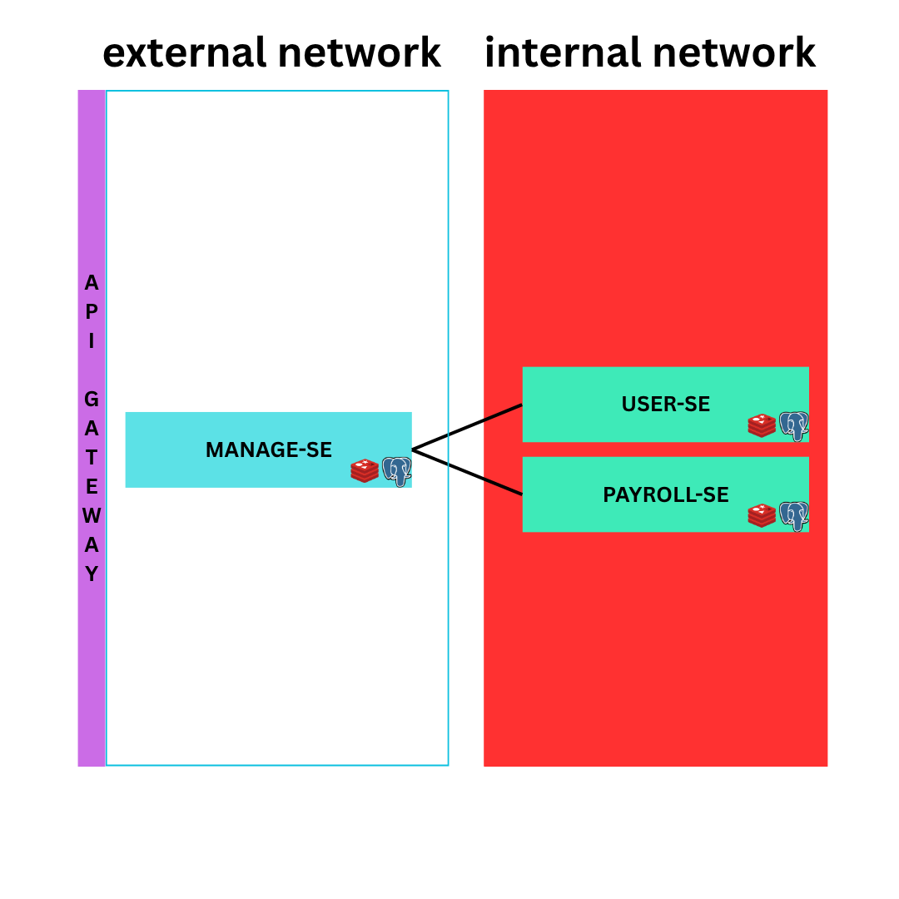

# Case Study - Back End Engineer

This project consists of multiple microservices that work together in a modular architecture. Each service has its own responsibility and can be run independently.

## Overview

- `docker-compose.yaml` is used to run service dependencies such as databases or other infrastructure components.
- The system is divided into **External Services** (accessible by users) and **Internal Services** (only accessible within the internal network by other services).

## Architecture



### Service Classification

- **External Services**:  
  Services exposed to users or external clients.
    - `manage-se`

- **Internal Services**:  
  Services that are only accessible within the service network. These support the external services.
    - `payroll-se`
    - `user-se`

---

## Project Structure and Boilerplate
Each service follows the same project structure with a clear separation of concerns. The main layers are:
router → usecase → service → repository

### 🔹 Router

- Located at:  
  `internal/router/router.go`
- Responsible for defining HTTP routes and connecting them to the appropriate usecase.

### 🔹 Usecase

- Acts as the business logic coordinator.
- Receives requests from the router and delegates work to the service layer.

### 🔹 Service

- Contains domain-specific logic and processing.
- Handles validations, aggregations, and orchestrations before calling the repository.

### 🔹 Repository

- Responsible for database interactions.
- Implements low-level CRUD operations using SQL or an ORM/DB client.

This layered architecture improves readability, testability, and separation of concerns.

---


## How to Run the Services

Make sure dependencies are up and running via `docker-compose up -d` before starting any service.

### ✅ Manage Service 
```bash
cd manage-se
go run main.go db:migrate up
go run main.go http
```


### ✅ User Service
```bash
cd user-se
go run main.go db:migrate up
go run main.go http
```

### ✅ Payroll Service
```bash
cd payroll-se
go run main.go db:migrate up
go run main.go http
```
